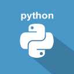
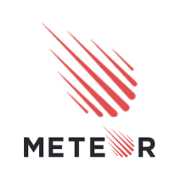

<!--
aws
android
angular
big_data
boostrap
css
docker
flask
github
grunt
html5
ios
java
javascript
jquery
meteor
mongodb
nodejs
python
reddis
ruby_on_rails
ruby
spring_mvc
windows
-->

**Full Stack**

| Projects | Teams | Stacks |
| :-------------: |:-------------:| :-----:|
| [wukong](https://github.com/BitTigerInst/wukong) | BJGX (白驹过隙) |    |
| [Crawler-bitTiger](https://github.com/BitTigerInst/Crawler-bitTiger) | BJGX (白驹过隙) |  |
| [美食爬虫和搜索](https://github.com/BitTigerInst/Pikachu)| Pikachu  |    |
| [Mongoose MovieWishList Generator](https://github.com/BitTigerInst/Mongoose-MovieWishList-Generator) | Mongoose |    |
| [FalconCrawler](https://github.com/BitTigerInst/FalconCrawler) | Fighting Falcon |   |
| [MEANTaurus](https://github.com/BitTigerInst/MEANTaurus) | Fighting Falcon |   |
| [Lab Document System](https://github.com/BitTigerInst/LabDocumentSystem) | Sly pyhton |    |
| [MonkeyKing Crawler Recommender](https://github.com/BitTigerInst/MonkeyKing_crawler_recommender) | MonkeyKing01 |   |
| [Gloomy Bear Financial Crawler](https://github.com/BitTigerInst/Gloomy-Bear-FinancialCrawler) | Gloomy Bear |    |
| [Kungfu Panda AppStore](https://github.com/BitTigerInst/Kungfu_Panda_AppStore) | Gungfu_Panda |   |
| [Zeus](https://github.com/BitTigerInst/Zeus) | cc13ny |  |
| [GamesStore Website in Java](https://github.com/BitTigerInst/GamesStore---Website-in-Java) | Totoro |     |
| [Catshark](https://github.com/BitTigerInst/Catshark) | Catshark |   |
| [Appstore by React](https://github.com/BitTigerInst/RealMonkeyKing) |  RealMonkeyKing | |

**Mobile**

- [AndroidChat] (https://github.com/BitTigerInst/AndroidChat)
- [Empachat](https://github.com/BitTigerInst/Empachat)
- [calabashCat](https://github.com/BitTigerInst/calabashCat)

**Big Data**

- [Bigdata_Analysis](https://github.com/BitTigerInst/bigdata_analysis)
- [TwitterAnalytics](https://github.com/BitTigerInst/TwitterAnalytics)
