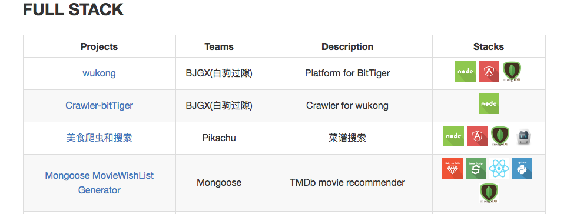

# Project Markdown/HTML Table Generator

The *Project Markdown/HTML Table Generator* reads project data from `projects.json` and generates stylish **markdown**/**html** tables. [Check out a sample here. ](./OutstandingProjects.md)



## Run the script

```
python ./scripts/md_table_generator.py
```

**Output**

- `OutstandingProjects.md`: a markdown file containing all tables
- `<category_1>.html`: a html table file containing the projects in *category_1*
- `<category_2>.html`: a html table file containing the projects in *category_2*
- ...

>**Note:** Code only tested on OSX with python pre-installed.

## projects.json

The `projects.json` should be in the same folder as `md_table_generator.py` and provide properties `name`, `category`, `project_url`, `team`, `description`, `stack` as shown below:

```
{
   "projects":[
      {
         "name":"wukong",
         "category":[
            "full stack"
         ],
         "project_url":"https://github.com/BitTigerInst/wukong",
         "team":"BJGX(白驹过隙)",
         "description":"Platform for BitTiger",
         "stack":[
            "nodejs",
            "angular",
            "mongodb"
         ]
      },
      {
         "name":"Crawler-bitTiger",
         "category":[
            "full stack"
         ],
         "project_url":"https://github.com/BitTigerInst/Crawler-bitTiger",
         "team":"BJGX(白驹过隙)",
         "description":"Crawer for wukong",
         "stack":[
            "nodejs"
         ]
      }
   ]
}
```
#### Category Property

`category` means the project category in the JSON file. Currently, only `full stack`, `mobile` and `big data` are supported in this field. If a project lists `full stack` as one of its categories, it will show up in the *Full Stack* project table. As suggested by the JSON array syntax, one project may have more than one category.


#### Stack Property

`stack` property means the project's technology stack. Each item in the array will be replaced by an icon in the table. The script generates html image tags `...</img>` to embed those icons. For example, a `nodejs.png` will be embedded in the table if the `stack` property contains `nodejs`. However, all items inside the `stack` property should match the exsiting file names in the folder `resource/icons`.

Only following items are supported at this moment:

>android
angular
aws
big\_data
boostrap
cordova
css
docker
firebase
flask
github
grunt
html5
ios
java
javascript
jquery
meteor
mongodb
mysql
nodejs
python
react
reddis
ruby\_on\_rails
ruby
spark
spring\_mvc
tomcat
windows

## Acknowledgements

*Project Markdown Table Generator* makes use of the following open source projects or resource:

 - [python-markdown2](https://github.com/trentm/python-markdown2)
 - [iconfinder:Jozef89](https://www.iconfinder.com/Jozef89)
 - Let me know if I miss something...

## License
Code released under the [MIT](https://opensource.org/licenses/MIT) license.

## Repository information
- category: full stack
- team: Fighting Falcon
- description: Generate stylish markdown/html tables based JSON.
- stack: nodejs, angular
